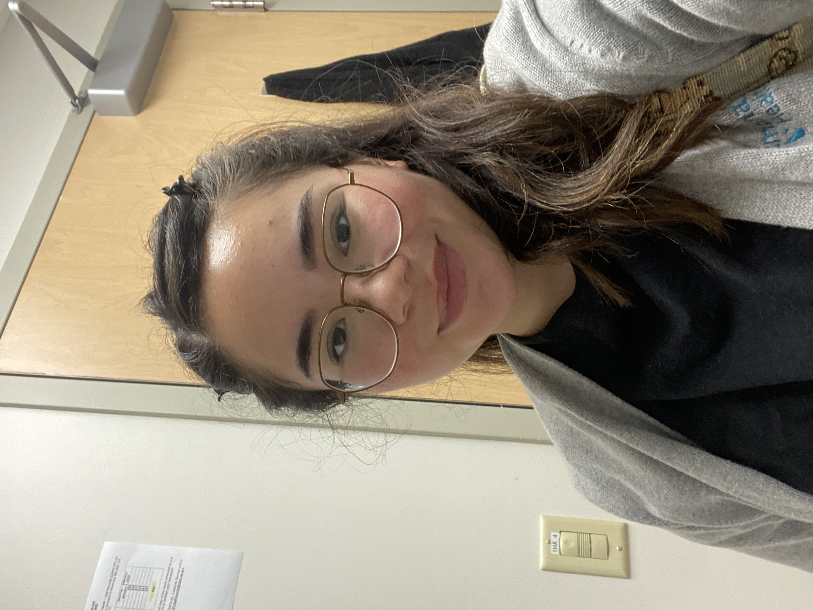

# Welcome

This website is for my M10 assignment. I created it to practice building a Quarto website, adding a dashboard, and explaining Shiny apps in a simple way.

## About Me

**Name:** Alexandria Jaimes  

**Career Goal:** My career goal is to work in digital marketing. I’m interested in using creativity, social media, and data to help brands connect with people.

## My Photo

{width="250"}

## Skills

- Digital marketing
- Social media
- Content creation
- Data analysis in R
- Quarto reports and websites
- Excel and basic data cleaning

## Education

I’m a student at Cal Poly Pomona. Through this class, I’ve been learning how to use R, Quarto, dashboards, and websites to organize and share data projects.